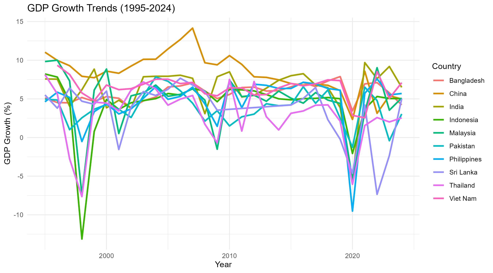

# Emerging Asia GDP Growth Analysis (1995–2024)

A panel data econometrics project analysing the macroeconomic determinants of GDP growth across 10 emerging Asian economies using World Bank data. Built in R as part of MSc Economics coursework at GIPE.

---

## Live Results

| Variable | FE Coefficient | Robust SE | Significance |
|---|---|---|---|
| Inflation | −0.203 | 0.043 | *** |
| FDI | +0.646 | 0.239 | ** |
| log(Trade) | +2.487 | 1.272 | . |
| Investment | +0.102 | 0.053 | . |

Hausman Test: χ²(4) = 30.82, p = 0.000003 → **Fixed Effects preferred**

---

## Project Overview

This project uses the World Bank Development Indicators (WDI) to study what drives GDP growth in Bangladesh, China, India, Indonesia, Malaysia, Pakistan, Philippines, Sri Lanka, Thailand, and Viet Nam over a 30-year period.

The analysis goes from raw data download → cleaning → descriptive statistics → three regression models → diagnostic tests → visualisations. Everything runs from a single R script.

**Inspired by empirical growth literature including:**
- Barro (1991) — Determinants of Economic Growth
- Hausman (1978) — Specification Tests in Econometrics  
- Wooldridge (2010) — Econometric Analysis of Panel Data

---

## Countries Covered

| Country | Avg Growth | Avg Inflation | Avg FDI | Avg Investment |
|---|---|---|---|---|
| China | 8.36% | 2.54% | 2.93% | 40.9% |
| Viet Nam | 6.43% | 5.61% | 5.15% | 32.4% |
| India | 6.35% | 6.55% | 1.42% | 32.8% |
| Bangladesh | 5.77% | 6.62% | 0.68% | 26.9% |
| Malaysia | 4.76% | 2.33% | 3.43% | 25.4% |
| Philippines | 4.76% | 4.44% | 1.78% | 20.8% |
| Indonesia | 4.35% | 8.27% | 1.32% | 29.6% |
| Pakistan | 3.88% | 9.40% | 0.96% | 16.1% |
| Sri Lanka | 3.50% | 10.20% | 1.18% | 28.5% |
| Thailand | 3.00% | 2.48% | 2.68% | 26.0% |

---

## Data

**Source:** World Bank Development Indicators (WDI)  
**Period:** 1995–2024  
**Observations:** 294 (after removing missing values)  
**Access:** via `WDI` package in R — fully reproducible, no manual download needed

| Variable | WDI Code | Description | Role |
|---|---|---|---|
| `gdp_growth` | NY.GDP.MKTP.KD.ZG | Annual GDP growth (%) | Dependent |
| `inflation` | FP.CPI.TOTL.ZG | CPI inflation (%) | Independent |
| `fdi` | BX.KLT.DINV.WD.GD.ZS | FDI net inflows (% of GDP) | Independent |
| `trade` | NE.TRD.GNFS.ZS | Trade openness (% of GDP) | Independent |
| `investment` | NE.GDI.TOTL.ZS | Gross capital formation (% of GDP) | Independent |

---

## Methodology

### Models Estimated

**1. Pooled OLS (baseline)**
```
gdp_growth = α + β₁inflation + β₂fdi + β₃log(trade) + β₄investment + ε
```

**2. Fixed Effects (Within estimator)**
```
gdp_growth = αᵢ + β₁inflation + β₂fdi + β₃log(trade) + β₄investment + ε
```
Controls for all time-invariant country-specific factors (institutions, geography, history)

**3. Random Effects**  
Compared against Fixed Effects using the Hausman test

### Model Selection
Hausman test strongly rejects Random Effects (p < 0.001) → Fixed Effects is the correct specification

### Diagnostic Tests

| Test | Statistic | p-value | Result |
|---|---|---|---|
| Hausman (FE vs RE) | χ²(4) = 30.82 | 0.000003 | Use Fixed Effects |
| Breusch-Pagan (heteroskedasticity) | BP = 3.70 | 0.449 | No problem |
| Breusch-Godfrey (serial correlation) | χ²(25) = 65.95 | 0.000015 | Use robust SE |

Serial correlation detected → HC1 robust standard errors applied to final model

---


## Figures



Other charts:
- [Inflation vs Growth](inflation_growth.png)
- [FDI vs Growth](fdi_growth.png)
- [Average Growth by Country](avg_growth.png)
- [Correlation Matrix](correlation.png)

## How to Run

**Step 1 — Install packages** (only needed once):
```r
install.packages(c("WDI", "dplyr", "ggplot2", "corrplot", "plm", "lmtest"))
```

**Step 2 — Run the script:**
```r
source("AsianGrowthRate.R")
```

Figures save automatically to a `figures/` folder in your working directory.

---

## Repository Structure

```
├── AsianGrowthRate.R       # main analysis script
├── figures/
│   ├── gdp_trends.png
│   ├── inflation_growth.png
│   ├── fdi_growth.png
│   ├── avg_growth.png
│   └── correlation.png
└── README.md
```

---

## Tools & Packages

| Package | Purpose |
|---|---|
| `WDI` | World Bank data download |
| `dplyr` | Data cleaning and summarising |
| `ggplot2` | All visualisations |
| `plm` | Fixed Effects and Random Effects panel models |
| `lmtest` | Breusch-Pagan, Breusch-Godfrey tests, robust SE |
| `corrplot` | Correlation matrix plot |

---

## Key Findings

- **Inflation** consistently hurts growth across all specifications
- **FDI** has a positive and significant effect — technology and capital spillovers matter
- **Trade openness** turns positive under Fixed Effects — OLS result was biased by country-level characteristics
- **Investment** is a positive driver of growth even after controlling for unobservable country factors
- Results are robust to HC1 standard errors correcting for serial correlation

---

*MSc Economics | Gokhale Institute of Politics & Economics (GIPE) | 2025*  
*Data: World Bank Development Indicators — [data.worldbank.org](https://data.worldbank.org)*

